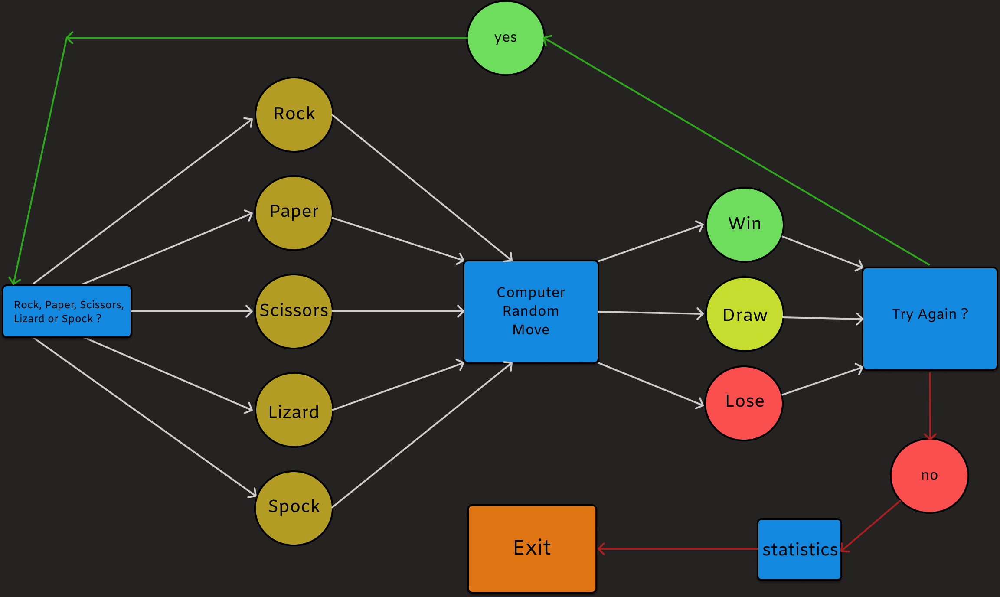
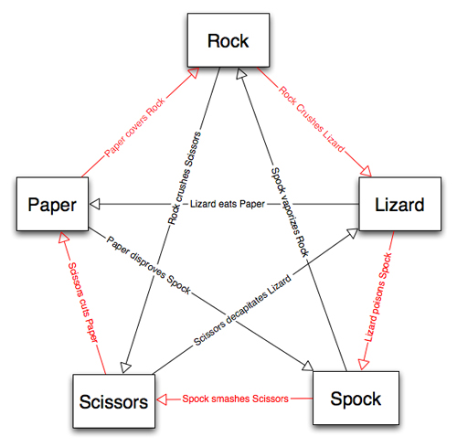

# Rock-Paper-Scissors-Lizard-Spock Console Game By Ivan Marinov

## Description:

- A version of the popular game ROCK - PAPER - SCISSORS with the addition of the LIZARD and SPOCK as thought of Sam Kass with Karen Bryla.
- It was popularized by the TV SHOW "The Big Bang Theory", episode ---> The Rothman Disintegration" (S05E17)
- This is a simple Console Game implemented in C# and .NET Core.
- Console only, no GUI available.

## Technology stack:
- C#
- .NET Core

## Design Diagram:

## Rules Diagram:

## Rules
- Scissors cuts Paper
- Paper covers Rock
- Rock crushes Lizard
- Lizard poisons Spock
- Spock smashes Scissors
- Scissors decapitates Lizard
- Lizard eats Paper
- Paper disproves Spock
- Spock vaporizes Rock
- Rock crushes Scissors

  ## --------Or you can listen to Sheldon explain it--------

## Screenshots: 

 
